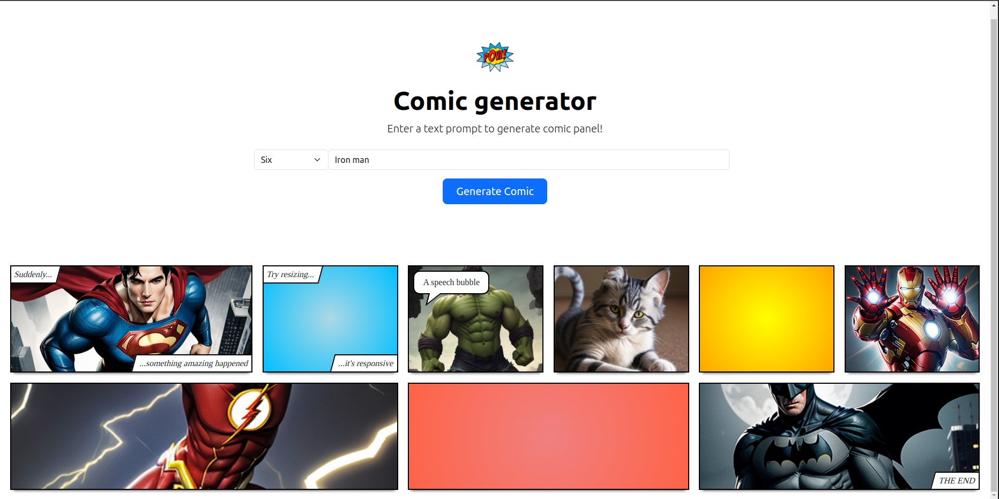

# Comic panel generator!

A simple web application that allows users to create and share a 9-panel comic strip. The comic is generated by inputting text into a form, which is then sent to a text-to-image API using a provided API key

## Requirements

### Node

If the installation was successful, you should be able to run the following command.

    $ node --version
    v18.18.0

    $ npm --version
    10.1.0

If you need to update `npm`, you can make it using `npm`! Cool right? After running the following command, just open again the command line and be happy.

    $ npm install npm -g

---

## Install

    $ git clone https://github.com/harshjawla/Comic-generator-Dastoon.git
    $ cd Comic-generator-Dastoon
    $ npm install

## Running the project

    $ npm start

## Simple build for production

    $ npm build

## Screenshots

